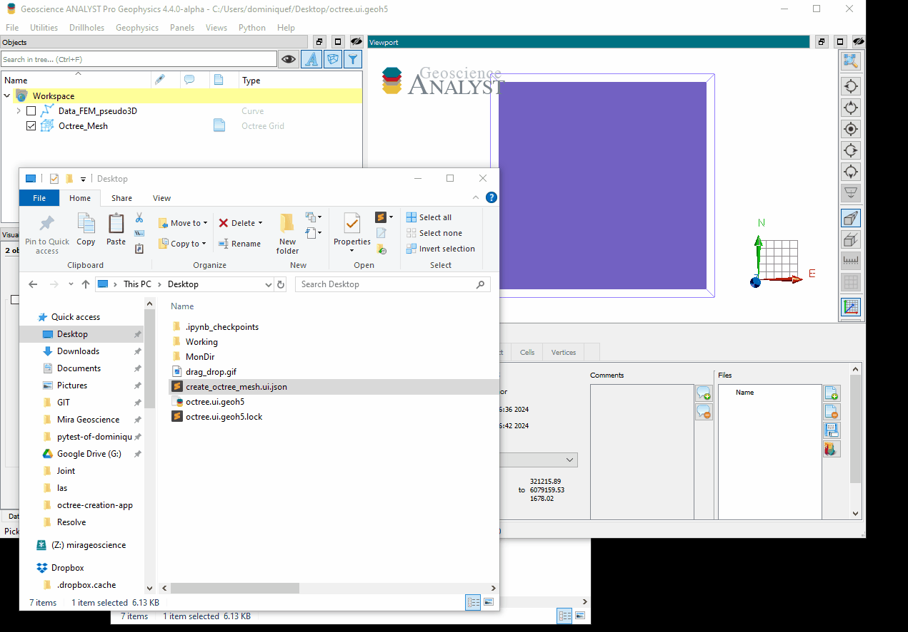

.. _usage:

Basic usage
===========

The main entry points to the various modules are ``ui.json`` file (stored under the ``las_geoh5-assets`` directory).
The ``ui.json`` has the dual purpose of (1) rendering a user-interface from Geoscience ANALYST and (2) storing the input
parameters chosen by the user for the program to run. To learn more about the ui.json interface visit the
`UIJson documentation <https://geoh5py.readthedocs.io/en/v0.8.0-rc.1/content/uijson_format/usage.html#usage-with-geoscience-analyst-pro>`_ page.

User-interface
--------------

The user-interface is rendered in ANALYST Pro by one of two methods.
Users can either drag-and-drop the ui.json file to the viewport:

.. figure:: ./images/basic_usage/drag_drop.gif
        :align: center
        :width: 800

Alternatively, users can add the application to the choice list of ANALYST-Python scripts:

Note that ANALYST needs to be restarted for the changes to take effect.

From command line
-----------------

With its installation, the package provides scripts to run from command  line.

.. note::
    If installed within a conda environment, first activate the environment with::

    $ conda activate <env_name>

    where ``<env_name>`` is the name of the conda environment.

The application can be run from the command line if all required fields in the ui.json are provided.
This is useful for more advanced users that may want to automate the mesh creation process,
or re-run an existing mesh with different parameters.

To run the application from the command line, use the following::

    $ las_to_geoh5 parameters.json [-o output_geoh5]
    $ geoh5_to_las parameters.json [-o output_dir]

where ``parameters.json`` is the path on disk to a JSON file with the required input parameters.

If optional ``-o`` (or ``--output``) value is not provided, the program will write out to the location
specified by the JSON file.
